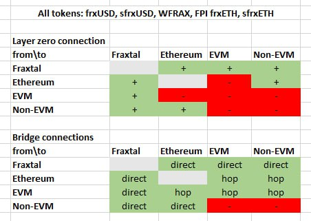

# FRAX DVN testing on mainnet

* `owner` : `0x45dce8e4f2dc005a5f28206a46cb034697eeda8e`
* `delegate` : `0x45dce8e4f2dc005a5f28206a46cb034697eeda8e`
* `proxyAdmin` : `0x45dce8e4f2dc005a5f28206a46cb034697eeda8e`

* `ethereum` , `blast` , `base` , `mode` , `sei` , `frax` , `xlayer` , `sonic` , `ink` , `arbitrum` , `optimism` , `polygon` , `avalanche` , `bsc` , `zkpolygon` , `berachain` , `worldchain` , `unichain`
  * `mockFrax` : `0x57558Cb8d6005DE0BAe8a2789d5EfaaE52dba5a8`
  * `fraxOFTWallet` : `0x741F0d8Bde14140f62107FC60A0EE122B37D4630`
* `zksync`
  * `mockFrax` : `0x3Fc877008e396FdD7f9Ee3Deb2e8A54d54da705A`
  * `fraxOFTWallet` : `0x0065435a2FcC4D4D5CD2c284C5daA9588E6fe03d` 
* `abstract`
  * `mockFrax` : `0xBd39033994F5324Fe8D50bB524396A78ff9dFe22`
  * `fraxOFTWallet` : `0x72018C396221e5919c856a809E3Be54CbfDb1fa2`
* `linea`
  * `mockFrax` : `0x6185334f1542a9966CbaD694577fFbede3DD1f1F`
  * `fraxOFTWallet` : `0xD555D90A6b23B285575cd6192D972e35F70b5B89`
* `aptos` , `movement`
  * `mockFrax` : `0xa1bb74f0d5770dfc905c508e6273fadc595ddc15326cc907889bdfffa50602c8`
  * `fraxOFTWallet` : `0x09d0eb2763c96e085fa74ba6cf0d49136f8654c48ec7dbc59279a9066c7dd409`
* `solana`
  * `mockFrax` : `4vMFmyM9nyUEQEBFgb55sFDswscNLQUoj2yAahPfUs3Z`
  * `fraxOFTWallet` : `53dNdHXc7uruWqELhWtpx4f4UvpPk5SaT1upQNoKdi7y`

fraxDVN test transactions :

frax  : https://layerzeroscan.com/tx/0x14b8d88435549bc5c82f4efd524b10e7d5e930c4e68f3007148d2b6366d922ec 

Ethereum  : https://layerzeroscan.com/tx/0x8400c973dcee183039c57036343c088d2b8e48f4b28b03b2e5f05ae8e70b3885 

Blast : https://layerzeroscan.com/tx/0x1981c1fa2c54efb047ae6590662acb584734552bfdb0a47bf44be15f84643063 

Base  : https://layerzeroscan.com/tx/0xafc7ac9513d37f70ae3bc84170a3b8bb16e68aebc64593bf60fdfc9f638b97ff 

Mode : https://layerzeroscan.com/tx/0x39be9865de498168b82b1ed71b539ff9d34f99ee33647ebb3addc8e6b744313e 

Sei : https://layerzeroscan.com/tx/0x5f8f1dfbedf467ee4d4e702e9733c8bac3873d89627e19c68637195027c4917c 

Sonic : https://layerzeroscan.com/tx/0xfe5be4c58299786a5b09eb7832828c53f2c11d391823a51b4deacd192869dc57 

Ink : https://layerzeroscan.com/tx/0xb8166bbdf34188a84846ffca307b2ca46f45814f7e779e5b297a72d34d238dca 

Arbitrum : https://layerzeroscan.com/tx/0x41b2a0b6574a384ee62cc0cb69294dda673a1be89a28e25b1b2b90d22b6737bb 

Optimism : https://layerzeroscan.com/tx/0x5dea6ee4e0b5b7c432c599f065ad971c2407480a6d58fbf4f1bc75598653b97f 

Polygon : https://layerzeroscan.com/tx/0xe635d80c97d4fed976a98799c2bb2841838e94652cd3171ec2626583ff7855b4 

Avalanche : https://layerzeroscan.com/tx/0x66ea1c3394945498e41a66a82d57c1c721b6b577213e6dd1ece6c2769c027aff 

BNB : https://layerzeroscan.com/tx/0x9dee674687729eb9516f0f4d25fbc52ddd1e47d7cdcf83c0969f442b4497ca9a 

Zkpolygon : https://layerzeroscan.com/tx/0x1dad4bb882a7181ba6944f3abc569586272ca5e409e1e850afa49d25018c247a (225000 confirmations??)

Berachain : https://layerzeroscan.com/tx/0xe2f8ce4b8dc5003a99c3f005b1539cc7e657c52687cda7f375055ebbbbfd3c46 

Linea : https://layerzeroscan.com/tx/0x0787f0e74163a12c29062e7518b0b97a17cdb07e2bc2219af8da266328e68648 

Worldchain : https://layerzeroscan.com/tx/0xfe2455d41968d5785bc58733adbd512fdbc617df5aa471db67a2d18d393f84c7 

Zksync era : https://layerzeroscan.com/tx/0xeeb621a2d3aab2ae028407e6c3fe8f73a100db423bfe85c007a20f36aa5069cd 

Abstract : https://layerzeroscan.com/tx/0xbd94362ebafdd3d90490c0a2df0697f05984e5237a061225c8accfa96db24c42

Xlayer : TODO

Ethereum to Unichain : https://layerzeroscan.com/tx/0x628a98a18066bd20f4d105ca8ea22ab23ed41b48732329fd325f7a7481ab84f1

Fraxtal to Unichain : https://layerzeroscan.com/tx/0x4522f5751464c60eff6b2a19c755fd6e9253e77875b380f8ab09ddcef86ec3c1

Blast to Unichain : https://layerzeroscan.com/tx/0xf55663a77894859d84d9763ba4efe4fe4e7fe3b9267bbb24ed2f776eb80836a1 

Base to Unichain : https://layerzeroscan.com/tx/0x2063631daf4200652597df30355277cfec6dc334824d25bea4fa2a08c1326fd3

Mode to Unichain : https://layerzeroscan.com/tx/0x521ceb760ac70d79f589a7772e032a9e4dd02173a9e7b0dcf0d6fd6ac5138e94

Sonic to Unichain : https://layerzeroscan.com/tx/0xb858ac3d2e27dbe8f84a7f3d5668a46bcace775b87593af4474f56c1bc0a2f36

Ink to Unichain : https://layerzeroscan.com/tx/0x73ce1446e7d887b2df2c635126f8ea890d7fc166c3cece1cd4fe32b203aadba9

Arbitrum to Unichain : https://layerzeroscan.com/tx/0x0cf7b2a5161fef8d8072089bc7111dc9509479e97e642f55701556417d9a74bb

Optimistic to Unichain : https://layerzeroscan.com/tx/0xd8d1fcc116bb84dff7898c46ff775c3d68d529c7f8f648070d1adb4b912c48fa

Polygon to Unichain : https://layerzeroscan.com/tx/0x1baa1298f8a6940a45b556282937eea901198c2d7d8cd2fcfee07c9d610cf149

Avalanche to Unichain : https://layerzeroscan.com/tx/0x9fc36bba2713ddbb67ae5dc1651cee76e0f20773ea33ae2943791cd414a1198f

bnb to Unichain : https://layerzeroscan.com/tx/0x71288508c6f5f72f8c5e7b5a6ae992be0f4599695c9fecd9d54f341a32758410

zkpolygon to Unichain : https://layerzeroscan.com/tx/0x59d5fbaa22a5af694e20dfa7c1a01baa54a1e55e828b04b4b6dfc07a09771ebe

berachain to Unichain : https://layerzeroscan.com/tx/0x3ede4865f5b35fd5c1e31f60711943dbc9c1b29b915ba9681129977bfbddbf9e

linea to Unichain : https://layerzeroscan.com/tx/0xb0979ca60ec85e5f7e5743e0bc2b76929f19ece12420fffb439418ccaa37e67e

worldchain to Unichain : https://layerzeroscan.com/tx/0x817fc6d0e4899767f7658678657fa956c3e7e045630c8a03ccc5bc48be48f682

zksync to Unichain : https://layerzeroscan.com/tx/0x8325bbd6408288fb06abea48a4918410d5fccc7a6f7acf65c27176269d3472a6

abstract to Unichain : https://layerzeroscan.com/tx/0x079060b736bb5c8074f371f2c50e8ca0828741fed2bb97a27001e3a6fd6ceadf

worldchain : https://layerzeroscan.com/tx/0x0662527651bcc375230985fdb1da1bd736d67b7df5228960daa3a74b42522618

## Non-EVM frax DVN test

### EVM to movement/aptos/solana

* fraxtal : https://layerzeroscan.com/tx/0x0deee80bc8a98e415a77947ddc03e02c02d5d19577aa0f7f977d49c3cdd49c9f

* ethereum : https://layerzeroscan.com/tx/0x3eefd91fb7027bdc9b936c4c4b6393d012cf2d206ed2a86d63ec701ea150ea89

* blast : https://layerzeroscan.com/tx/0x65b231c989d92bd6d08f0bcdd75f81a39188b71a7c95b949b01b24583cf5fdaa

* base : https://layerzeroscan.com/tx/0xc3f36c64bd413e12e7f5e3a2bcc6ba79b58414701d71ea134da7a723c67ccd4d

* mode : https://layerzeroscan.com/tx/0x2f8619a3cbf421041b3ef19bb0d4af1e75c7000c82352320ebc946f0cd99563e

* sei : https://layerzeroscan.com/tx/0x2c6c0541959dbdf83921ba43f54f76ee240ea62499b1e1c75b9957c7dd6254a4 (not peered to movement)

* xlayer : https://layerzeroscan.com/tx/0x24042022024034030fdd3e43b7b41753836faf15aa0dc8f381f75437a9f38001 (not peered to movement)

* sonic : https://layerzeroscan.com/tx/0x40cf72a4b49c53caebb9e2d26827ce70554b48c5a4013187fa04bcb5a106ad42

* ink : https://layerzeroscan.com/tx/0x7c48a4eb5dd353b85d2c84f619b6c177a62fe25d9b8475c8cea79bfc00e59422 (not peered to aptos)

* arbitrum : https://layerzeroscan.com/tx/0x945de491ac7df337181161a54337d7b0e4e5c343f1f6bede75a5ba8df16a90c3 

* optimism : https://layerzeroscan.com/tx/0xbb0535ffbf717f15939d50abfd7e1169bd204d3413ad65e6c9ef8b8f0b7e476c

* polygon : https://layerzeroscan.com/tx/0x5c4c2a12c1fca3c9595da89f5020e3d11f40f91092e6386556d376111ffa8f5c

* avalanche : https://layerzeroscan.com/tx/0x35feee45a2de2559ab9a7440b694fe6103602a82de3b16b013eccfecf4300671

* bnb : https://layerzeroscan.com/tx/0x3d53899b21bc62d9131af71b172a0d62fac9369f733624e327254fb40c20ee87

* zkpolygon : https://layerzeroscan.com/tx/0xadd00296ecfa22cd2be5b7301af143340c9d2a26f21b7fcd4f27cb8f1955a056 (not peered to aptos)

* berachain : https://layerzeroscan.com/tx/0x34391e60de136dcb19c2df1e6c9552e68c574d52b59f119ab47ae0a5726fda40

* linea : https://layerzeroscan.com/tx/0x3dfe5e706252b2c265d1a044e12f739451dd899290319ad35ccbc7281cb1e568

* worldchain : https://layerzeroscan.com/tx/0x4ca369f9cda9e235ccfcf1fba7da2e7fa3fe80f2a296e1dadbe662da73ebf5f7 (not peered to aptos/movement)

* zksync : https://layerzeroscan.com/tx/0xe919e842c837f86f2ba79c1ce5aeea9174741c375d88af1533b51ad34a09d64e

* abstract : https://layerzeroscan.com/tx/0x418a007b58c8ab8413298b088ab6e4c211bc244b855c14ae94eb87c4fb93deb7 (not peered to aptos)

* unichain : https://layerzeroscan.com/tx/0xa1028f2c0937f32cf88ae3a9c857a6e78f0fff03a2840090378afc5dd495bd10 (not peered to movement)

### aptos to EVM

* fraxtal : https://layerzeroscan.com/tx/0xfe7c2f7872b8210e283e836b1db825dab2b6536c4219f2ffdf175fbf7e7380d1

* ethereum : https://layerzeroscan.com/tx/0x3f61a4bf4aad379a8cec1643e2b98335206a7d5547036d991b51ba464c7a01d9

* blast : https://layerzeroscan.com/tx/0x4e0bc7ae014e208f94a97c8903098d38fbd01f755255d57d843af46ca894798b

* mode : https://layerzeroscan.com/tx/0x2483a812c3b0815e03fd710c7b03ca276d575701d5f9ffb4ae5f1e1c40cc79ec

* sei : https://layerzeroscan.com/tx/0x9db00afb237b1a316e297618a849e7654cd04af877c672554acb1adfd858f8e1

* xlayer : https://layerzeroscan.com/tx/0xdff2e0eebf124af0876454804a0866490f230bc01be659130bfbc90e8691eb8a

* sonic : https://layerzeroscan.com/tx/0x3201903a3dcbadbbdaf26e80d2205e03fb6a279e835eea9a88c4cb40511b1f37

* arbitrum : https://layerzeroscan.com/tx/0xc4c130968bef237e15151986b5248f297d21af32d04499b8fc4ef6d689cb50e6

* optimism : https://layerzeroscan.com/tx/0xe1739adaf1ddafa61d716707d31c8f00b6aac8f0f7b4fe1ccc1181dcb04cf731

* polygon : https://layerzeroscan.com/tx/0xe3c75b40e0e532657eae62c177c6ad86e00810065328e649ad84945126ae2f02

* avalanche : https://layerzeroscan.com/tx/0x1357ed2d6f2a2e13130a3163b615a1207ab95c8e821a4f605d8bf8a7ff26cea9

* bnb : https://layerzeroscan.com/tx/0x59331c6c3c8b3e6a97dfa97160f885b6b2732af67acf3beab850487ee05cbb62

* berachain : https://layerzeroscan.com/tx/0xdacacfb19127ab74285faf0c38bdc84dc2612c346abe29ed5a4d67740046b699

* linea : https://layerzeroscan.com/tx/0xd738f5bd065aff708092af30b790487731f5688bc23436170ec3d529f852a4e3

* zksync : https://layerzeroscan.com/tx/0x87f50562086ff1394dc4e588862f7111aa454d38421b683798e98ba78aecc128

* unichain : https://layerzeroscan.com/tx/0xf1ec2b69251051d6056a3ee928bd7459552d8fd765d51e6f7789b5242bf8c2c6

* solana : https://layerzeroscan.com/tx/0x5051f02e15bcf4e80d1a9b27489d6c6a120bcf5e99baa7af18755f4e25e5cdc2

### movement to EVM

* fraxtal : https://layerzeroscan.com/tx/0x5a3abb733c62b9713110adde4568f689be5bb69cca79d55f374b754ae7025942

* ethereum : 

* blast : https://layerzeroscan.com/tx/0x93064f459a339c02d9f99339cc34db00fb0b197f278007b02e5b38177ad7cacf

* base : https://layerzeroscan.com/tx/0xdea8756035d720ef1a09d9439ac97d6d8fc1270a2468e0578590c9483c1db1a9

* mode : https://layerzeroscan.com/tx/0xd80f4e9df9ebfdbbf903e5b8acec1f86d47ea0ff4caba6a5341cdde1b7d9c570

* sonic : https://layerzeroscan.com/tx/0xbb0d3d2db7607273cadfffcd3579c4a663c5bec9c815a1daf9df9ef176eef0d8

* ink : 

* arbitrum : https://layerzeroscan.com/tx/0x9f0d799a4dd81b50dd5670b631f9bc8b6caf47336cc93760b74502ef2836dde9

* optimism : https://layerzeroscan.com/tx/0x8a0c868b22c859e80c58469fac7053150c23c8f14e8b2ab6edbdc84de1c5d92b

* polygon : 

* avalanche : https://layerzeroscan.com/tx/0x7cd6f3a6e81f7e601259a227733f9a582966ff6f28eb20543653baa2ebd96e69

* bnb : 

* zkpolygon : https://layerzeroscan.com/tx/0xa20a78923b4005ef7503d642ea18f7d5b62862b16fad33a909e943c619a6a1f3

* berachain : https://layerzeroscan.com/tx/0xd3cedd8fd4bb9a3e5529c14adc9b2c42272b6b34d65938ad9ac69f24d617f784

* linea : https://layerzeroscan.com/tx/0x05c98ad561c4392f62cccd89a3b185c6b72b4214a6bfdd899f6ae90122ca9f37

* zksync : 

* abstract : https://layerzeroscan.com/tx/0x2e8d6da7eae86d0a8ce930afb9cfded818e2a5781a310db610ab932459885ada

* solana : https://layerzeroscan.com/tx/0x84cc470a5fa4dfd2e2124e19e38c0b07a5bce511b311ef724825226a097eca1d

### solana to EVM

* fraxtal : https://layerzeroscan.com/tx/4ntFu3VaYYvzX7XNzenP4on5wz1fXNgww6y91F9DpjSJUshGN5u8KfuexGXHm9CATfb1x1WAgSNnRuxRHLTWAa6G

* ethereum : https://layerzeroscan.com/tx/5gDp6tKWWZYkj37ywP8gBLBGais3oX32PdgcCHUrE4yYQVv5LT1BDxZNLwkfnQV5dYM7iMp71kTUx5RmFeMRjFw6

* blast : https://layerzeroscan.com/tx/bSdgqhMU9kYq9TSsz4Rh3PLuiYQF9VRGoSDbjETFpL67SfL7YLUyfjghyjBA2H3dBsdSwmnFN5Qzudro4D79tkx

* base : https://layerzeroscan.com/tx/5NjphE6WxxB4JML2X2H8UzeU5JFbEd5YAmb26hgDgA8cwr161jkoaG7r5Yrvt5k1rrmPTo2hft7co8tTsRbuoSX8

* mode : https://layerzeroscan.com/tx/3aWN5T1HLg6N55AuazbmJh3cCMf5JMkoYUULBnxyaqGZS58x3X81eYkEPPPpotD3cQifVv3nGq9k34oHrt2wwNsN

* sei : https://layerzeroscan.com/tx/iQtLqP8TddJ3JbiKTeWp2p7rPn6hB4qb3J8T7TBaNTkjSqF8wJ19bb4Gnt38YA1txBAXEgma1GZMvzPYXPuUamy

* xlayer : https://layerzeroscan.com/tx/58KrPaw7FAFQDeLjbLkfjxbqewncGWrTLYxEAVG3YbgpMdL5n6hh9gAiWYeepkoKnQ8JmY2wGADqReXSzeZcPdRc

* sonic : https://layerzeroscan.com/tx/vREQyhHQBhxZH1Mpaey6ttEjAmgyYBExkVmXH8wFt3HiHFHmFncJc5nDxF5tWxGDCRNrY7byakLobdFHK5X9HS1

* ink : https://layerzeroscan.com/tx/5CoUHDSQdL7vk4618ijwBw34DGfWY1zFsLMosCjrEkyexi7g9uxfgXMWJcYLe5aEdXkf7URedeye1v7Ht4RxeCqf

* arbitrum :  https://layerzeroscan.com/tx/2fCwpkXmMGDmT68AxXNk43YkPNWBjc3yzJTvVL8hQZrvg1yT1gAUfySY1ZQcKr1ix2xZonQcJYXQyxcmrGZ3UVRK

* optimism : https://layerzeroscan.com/tx/5DHCFSako7xWQUhxUxS2ZZoh8ncrgsi7AtCDnf3PvvMXV5UCDMEexAKFig7xXj6CYH47sTbVcNRfCb1cCXYtiZ3W

* polygon : https://layerzeroscan.com/tx/DRj7Aupo94ZLVWw35onyGpSwNgvF3nL6TTHnBqrqNYmmLLfQP6PXiBuHRfNrHG2wS7KDEJGFMwc9G5NZnraEjKF

* avalanche : https://layerzeroscan.com/tx/3xPjhgKMZ4BVzGSrDSDR1cqeVohwrYGRRRD869eBw6wmGNttpg8fCJaDibeVp5Kq741Z49QURXBAsuXvHJawnvi7

* bnb : https://layerzeroscan.com/tx/5c2Bp2Wo627qqjEGTcUmqcNWQke6NJHHWiaFBdsk2WFXE4hHwnTDd3W2eTCLZXmjqfFXZgsiyJBfdPU77E6Tsw3o

* zkpolygon : https://layerzeroscan.com/tx/3kt3psCcTpxdSq5WhSAFqdbWuH8fjAWpHnmb6jiZRzqB9x7zR524wBkbPC7BSxMhEpkiS4EToNrV9UaPMqcVLPnb

* berachain : https://layerzeroscan.com/tx/2RygnPFZNtqKAUWcR88Uh4qPEhHqAxqZwvGkjgDCg32NQHchTWULQnXRwnFZmG5HossoVncEREsad6uSuFiHy1YV

* linea : https://layerzeroscan.com/tx/2VcXSqHUnshP8xrnyTAPkTz3GZPGH34vmspxPdbJBivBRzdcxiQcDERfy32KYLTU2tmZRoaEMj51XN6PmHBiF99N

* worldchain : https://layerzeroscan.com/tx/2iZcFrzZTY1qjivP9TbRpP4ZJfyqWgeC3PwDyqMDn3UkQVJxuVbLTFvioQjCDsWUmYep62FqTg43pKYqUN9DXq1M

* zksync : https://layerzeroscan.com/tx/3BLP2tUwzhcQykHAjRtxFSo4KVWiefmQ5qA8QEDhNW5kGotDSDZV1U2K3EPVzCBUqZDmQpjTSKAgZPf9GUAhEMDV

* abstract : https://layerzeroscan.com/tx/21WgkfYdjz4pMBZ7R2bemhmspSKgktZEYcSbh13YtDfdP3ZjdXV9RoiFHHibtBaooXKSQpspbBUQCMxCc4z67rY1

* unichain : https://layerzeroscan.com/tx/5UnT6JNvhNgqs4oWzDJkjFzGj1EFSht8myQNwK59pSayd1nHjqkqEHBzpKbamJHPJB9dQdZqAu1VHuj2wwPhFc63

* aptos : https://layerzeroscan.com/tx/4c3NjT8DDYXN9mgwBXY4hr7DiADT16QX8yGi2HZ8q1HQgpCNrwF3ix55HNQpnaFFVMwaU5qspgMQB2ZZePk9eSwZ

* movement : https://layerzeroscan.com/tx/414mUi1Lg56ibqnBDPHnZkVxwFu7N9udwSqkHzGhYKG124Tdx92KzPGfzR6NKCrUDRgmBvmnbiVrEEyDfA2p31yv

## PlumePhoenix

* fraxtal : https://layerzeroscan.com/tx/0x02ef2d5c8bf9a5efd49575fb3680a29c8dfa5b080a7fd0eb8b63ed1a045fba51

* ethereum : https://layerzeroscan.com/tx/0xc61e9a05a5225cd48762dee03bf28d24f23978a1ef5271a4f78163ce4aaace72

* blast : https://layerzeroscan.com/tx/0x5501bf1a58678be6a5b93c0c48e4f2450a2cb1a740782a0820fdb1b0747498e3

* base : https://layerzeroscan.com/tx/0x6c2468618682f530eb036cf1b65156340d21f0f3474d593f42f5b336d4f785fe

* mode : https://layerzeroscan.com/tx/0xdb674d0fdc7917e80fd1a31c25ee012d164bf06e0a2a3c3a5668a76968555828

* sei : https://layerzeroscan.com/tx/0x3955314d894d53ef26a1718aafc2b172ce910464dde31f35acc4c5d090c37cb1

* sonic : https://layerzeroscan.com/tx/0xeca54945c9104240ad25ff1c57151ff8ae29a4918fab99007bdb8deea9eedbeb

* ink : https://layerzeroscan.com/tx/0xd81e0a79b5b03f71bbf5b501ae6344d2c6b96a878cd329a32f3d4ed27235908b

* arbitrum : https://layerzeroscan.com/tx/0xb878e88ed2976f5dc0ba376e144ae37f4b4cd540ca7620e90ce4e8511630f069

* Optimism : https://layerzeroscan.com/tx/0xc4d2fd925ec182e8c2213a0483021dcbf1441e0bdd5206f0aacece356b7c2bca

* Polygon : https://layerzeroscan.com/tx/0x6486fa17a2f69dc8c49084cacf68003133ee31b36dea1842184a88067f24807e

* Avalanche : https://layerzeroscan.com/tx/0x3b80b589b6dce18ef9048140da2cb8216a079b9d10e17b0683cdada6684f69a5

* Bsc : https://layerzeroscan.com/tx/0xfcd46204c07427b59de51c4cb003729d3bd96d9d72223a5197df2fc054816511

* Berachain : https://layerzeroscan.com/tx/0xc0ea95cb1be0418dc8183ff797b25cbdae920511eb9f177903aede1ae186a92c

* linea : https://layerzeroscan.com/tx/0x4931758beeb0980d0425e132e77c0bff3d0d65a3774b110268ef8fa61d9d7d80

* abstract : https://layerzeroscan.com/tx/0xa25ddc99db3c686d865800e902c1ad77e9865b6ce2df4692b49d05adb15d5331

* unichain : https://layerzeroscan.com/tx/0x1afad8b5b18fe4853b4aa162d1d6e6c5043f9f2bd145537766943b057764479d

* solana : https://layerzeroscan.com/tx/2YgNhJSSWr16MufMhbDcuYuBPcNYPJYUWpXo5nZR3btvmmVnAXnPxm7KgA2BgLZ3oQxhhB5p7XR7A7xj2KHQjqAx

* plumephoenix : https://layerzeroscan.com/tx/0x97d9b420c5ca5253ae56d2956bfa55a95948e703977410c47cacdb85d797ea53

## katana

* solana ; https://layerzeroscan.com/tx/2q4xYnP7UA1CP4Rp3WechMs7vzyV89TJ7xghwBWFnEL1CNa3dxxQ8z1Yyv2U2pMYUnGdim4hr9UqzmJGSASR1kzr

* frax : https://layerzeroscan.com/tx/0xd5fd1ebf8cfc3d4cecbf7396fa50313cdb045c7747a1c9827228a868fa693a81

* ethereum : DVN_EidNotSupported(30375)

* blast : https://layerzeroscan.com/tx/0xa6aa5d57acb545257a3f3f5407a948887c2885f15ff30fa6a5e89d3d0717f6c4

* base : https://layerzeroscan.com/tx/0xa2de96642a1d1f4dc5c22d68eed70ac50bb97877ab0ee462d3a6fcc825cd4dc3

* mode : https://layerzeroscan.com/tx/0x8be1c00a1df7068b12db1766184a2c28b9bc3f51886cf8709c1fbb587eb3ce69

* sei : https://layerzeroscan.com/tx/0x9811a11fb04e5fde4ac6259a362c2a1fa8f59f609f2f82929c430e78a53f10dd

* xlayer : https://layerzeroscan.com/tx/0xa02d006f0da8083ad43cbaf19b86e86753cdad7e4df5666ca0e0eff562c2509a

* sonic : https://layerzeroscan.com/tx/0x4bcbcfd7bc68a2fcdc1a505c974af5fc38d56810eda5a032b9538fc85a53e860

* ink : https://layerzeroscan.com/tx/0x8f503778329c8b529ceb9200d5b06ba621d949474915860736a828d7b8a5365e

* arbitrum : https://layerzeroscan.com/tx/0xa530de94aa789b07847524ec5828accbbde9cfb87fe8cea98ef4e342519c4d9e

* optimism :  https://layerzeroscan.com/tx/0x40162f9e0b331b727582e44a2554b0fcfe871ee65ee2afa04d774da981b92d63

* polygon : https://layerzeroscan.com/tx/0x70ecf9ec52a28f935bbff469de67bf45f6ee348a483de3c639749a6ea28fa688

* avalanche : https://layerzeroscan.com/tx/0x62141b35c0a87883aba6d71a0ccba4a32a39a473f343d9de333b52f9dd973929

* bnb : https://layerzeroscan.com/tx/0x0e7bcb2c7a33678b320a4ef95c3f204ac3e1941b9c643351a3fb452303ed57e5

* zkpolygon : https://layerzeroscan.com/tx/0x82c5673bdc157eea21f113eaceba28a47e50bd8a44ff8a866b27f9782a17decf

* berachain : https://layerzeroscan.com/tx/0x3c1188b528165cbc58dc105f3000e76f71e8007330aa775065c2178fc708f45a

* linea : https://layerzeroscan.com/tx/0x20eeaab5f1dc95338e2f7d97477e418d4a3bff2fe3d869145eac63b909696a96

* worldchain : https://layerzeroscan.com/tx/0x406cb0ce7eb509cd64d220a4b6d9323497c377d095721bb3918e77b997870de0

* zksync era :

* abstract : 

* katana : 